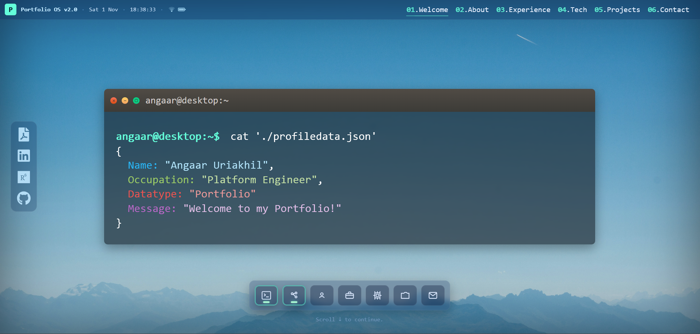

# Portfolio

My personal portfolio site rebuilt and enhanced using **React** and **Vite**.  
Originally created during week 2 of my software development course at \_nology using vanilla HTML/JS; this version modernises the stack, improves performance, and introduces a more modular, scalable architecture.

Fully responsive for Desktop and Mobile.

## 🚀 Overview

This project is a front-end portfolio used to showcase my skills, capabilities, professional experience and selected projects.  
It is a conversion of the original HTML/CSS/JS build into a **React SPA with component-based architecture**, smoother animations, cleaner file structure, and improved experience.

## 🎨 Design

The UI was initially designed and prototyped in [Figma](https://www.figma.com/file/UQ7NcCBE9NScccttfMR9e2/Portfolio---Week-1?node-id=0%3A1).

While the React version aims to loosely stay true to the original visual direction, there have been several changes to allow for:

- More of a unified feel across the site with an OS style permeating the whole site. e.g. A macOS style dock has been added to the landing page.
- The About page has been split into About, Experience and Tech Stack sections.
- The Socials bar has been styled into a more OS like component.
- Smoother animations & transitions.
- Completely redesigned layout for each section to aid usability.
- Scalable and reused components.
- Cleaner structure & maintainability.
- Modernization by using a JS Framework rather than Vanilla HTML/CSS/JS.

## ✨ Features

- React Single Page Application.
- Fast dev experience powered by **Vite**.
- Modern animations and scroll effects.
- Reusable UI components.
- Smooth navigation + scroll-to-section behavior.
- Mobile hamburger menu with animation.
- Custom terminal-style hero section.
- Performance-optimized images and assets.

## 🛠️ Tech Stack

### Languages & Frameworks

- **React 18 / JSX**
- **Vite**
- **JavaScript (ES6+)**
- **HTML 5**
- **CSS 3**

### Libraries & Tools Used

- `@vitejs/plugin-react` for React + Fast Refresh.
- [AOS – Animate On Scroll library](https://github.com/michalsnik/aos) by michalsnik.
- [Animate.css](https://animate.style/) by Daniel Eden and friends.
- [TypeIt React](https://typeitjs.com) by Alex MacArthur for typing animation on landing page terminal window.
- [Hamburgers](https://github.com/jonsuh/hamburgers) – CSS hamburger animations by jonsuh.
- [Interact.js](https://interactjs.io/) by Taye Adeyemi for draggable functionality on landing page terminal window.
- [Intersection Observer API](https://developer.mozilla.org/en-US/docs/Web/API/Intersection_Observer_API) for responsive underline on the navigation elements.
- Terminal CSS styling adapted from [FOBABS](https://dev.to/fobabs/how-i-built-a-typical-ubuntu-terminal-using-html-css-1bpj).

#### Icons

- [FontAwesome](https://fontawesome.com/)
- [react-icons](https://react-icons.github.io/react-icons/)
- [DevIcon](https://devicon.dev/)
- [Developer Icons](https://github.com/xandemon/developer-icons) by xandermon

## 📂 Project Structure

```
/src
 ┣ /assets        → images, icons, fonts
 ┣ /components    → reusable UI elements
 ┣ /scenes        → sections (About, Projects, Contact, etc)
 ┣ App.jsx
 ┗ main.jsx
```

---

## 🧪 Scripts

| Command           | Action                   |
| ----------------- | ------------------------ |
| `npm install`     | Install dependencies     |
| `npm run dev`     | Run development server   |
| `npm run build`   | Build production bundle  |
| `npm run preview` | Preview production build |

---

## 🚀 Deployment

Site is built using Vite and can be deployed to any static hosting provider (Netlify, GitHub Pages, Vercel, etc).

A `predeploy` script is included for SPA routing support.

## 🙌 Acknowledgements

Special thanks to the creators of the tools & libraries used in this project — they helped elevate the UI to a polished, modern experience.
